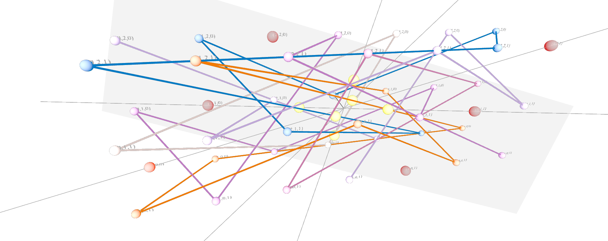
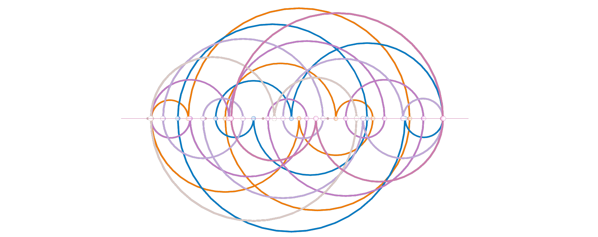

# Thinking inside the Box: Finding Groups.

A box is specified by a sequence of non-zero base numbers, say: `[ b_0, b_1, ..., b_(n-1) ]`.
> the box rank is the number of bases.

> the box volume is the product of the bases.

A box specifies a set of points, with order equal to the box volume, say: `[ x_0, x_1, ..., x_(n-1) ]`.
> for each place **i**: `0 <= x_i < b_i`.

#### Point Indexes:
The points in the box can be indexed so that:
  1. Every point has a unique index value that is between zero and the box volume minus one.
  2. The origin point [0,0, ..., 0] has the minimum index (i.e. 0).
  3. The point opposite to the origin, via the centre of the box, has the maximum index value (i.e. the box volume minus one).

A box of rank **n** has **n!** permutations of its bases,
each providing a linear place-value function that indexes the points as required.
Note that repetitions of the bases will duplicate permutations.

Each pair of indexes, laid side-by-side, provides a permutation of the points: a **box action**.
Note that a pair of identical indexes will implement the identity permutation.

A box has **n!n(n-1)** actions (excluding identical pairs) 
and they form a group with a structure entirely defined by the rank of the box.
  1. each action appears with its inverse
  2. each action has echoes

A box group contains subgroups that implement all possible factorings of the box volume,
thereby decomposing the box into constituent sub-boxes of lesser rank.

## Example: Box 3 x 5 x 7
The following table shows the labelled set of box actions, with inverses, echoes and identities removed.

NB: A radiance index and its square are reinstated to provide an identity. 

| Id | Label | Composition | Permutation Pair | Linear Place Function Pair | Identities | Orbits | Order | E-Per2 | I-Per |
|----|-------|-------------|------------------|----------------------------|------------|--------|-------|--------|-------|
| 0 | r | e^½ | | [6,2,1], [-6,-2,-1] | 0 | 21 | 2 | 413 | 441 |
| 1 | e | r * r | | | 42 | 0 | 1 | 0 | 0 |
| 2 | a_0 |  | [1,0,2], [0,1,2] | [3,1,21], [1,7,21] | 6 | 10 | 4 | 136 | 108 |
| 3 | a_1 |  | [2,0,1], [0,2,1] | [2,14,1], [1,14,7] | 6 | 3 | 12 | 93 | 63 |
| 4 | a_2 |  | [2,1,0], [1,2,0] | [6,2,1], [6,1,3] | 14 | 7 | 4 | 21 | 21 |
| 5 | c_0 | a_0 * a_1 | [1,2,0], [0,1,2] | [6,1,3], [1,7,21] | 2 | 1 | 40 | 173 | 245 |
| 6 | c_1 | a_2 * a_1 | [2,0,1], [0,1,2] | [2,14,1], [1,7,21] | 2 | 2 | 20 | 108 | 210 |
| 7 | c_2 | a_2^-1 * a_0 | [1,0,2], [0,2,1] | [3,1,21], [1,14,7] | 2 | 5 | 8 | 145 | 231 |
| 8 | z_0 | a_0 * a_1 * a_2 | [2,1,0], [0,1,2] | [6,2,1], [1,7,21] | 6 | 6 | 168 | 176 | 250 |
| 9 | z_1 | a_2^-1 * a_0 * a_1 | [1,2,0], [0,2,1] | [6,1,3], [1,14,7] | 2 | 4 | 20 | 176 | 252 |
| 10 | z_2 | a_0^-1 * a_2 * a_1 | [2,0,1], [1,0,2] | [2,14,1], [3,1,21] | 2 | 2 | 20 | 176 | 252 |

Each row can be visualised in 3 dimensions, 
showing the orbit perimeters, the orbit centres, 
and the fixed points, for example z_0

Each row can be visualised in 2 dimensions,
indicating the index radiance, for example z_0:

# Reference
E.g. see http://brentcroft.com/jumping-bases-numbers-dance/orbits.html
